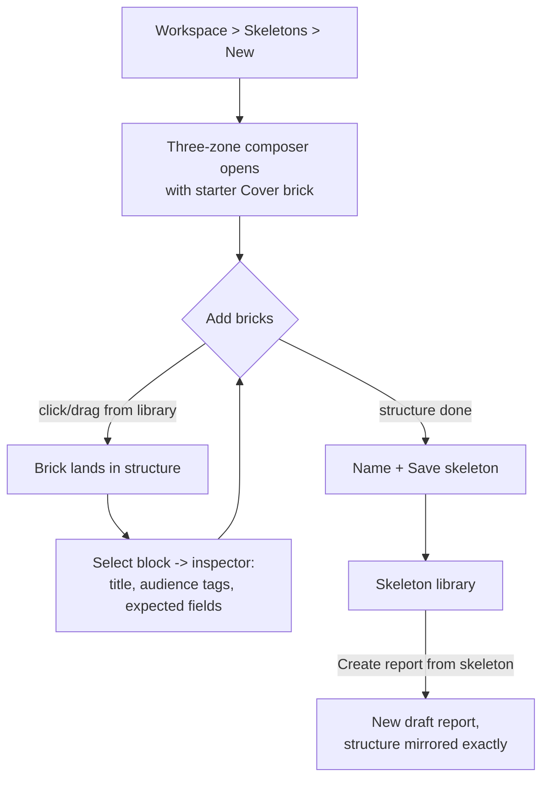
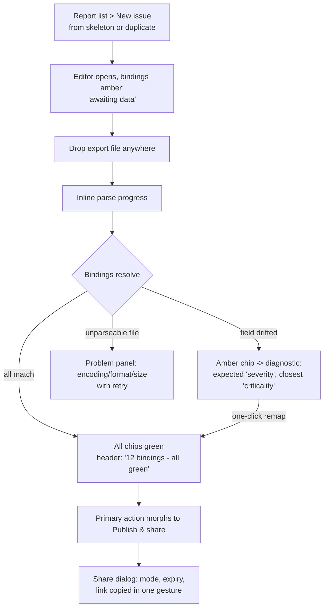
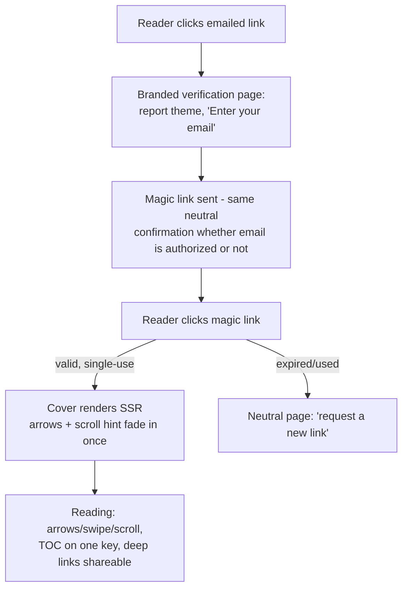
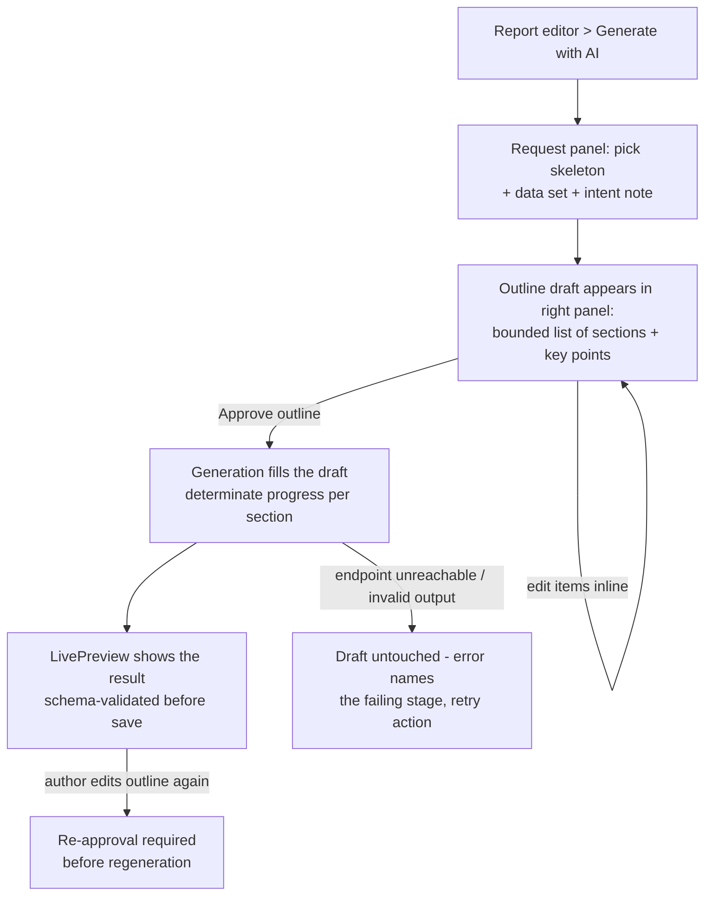

# UX Design Specification Acta Diurna

**Author:** Romain G.
**Date:** 2026-06-11

---

## Executive Summary

### Project Vision

Acta Diurna replaces the slide deck for recurring reporting: one declarative report, rendered beautifully by default, consumed as slides in a meeting or scrolled alone from an email link. UX is not a layer on this product - the reader-facing render IS the differentiator, and the author-facing cycle ("inject, glance, share") IS the founding promise that reporting becomes pleasant.

### Target Users

- **The author** (Remi archetype: security consultant, technical, daily reporting): lives in the workspace, composes skeletons once, re-fills them every cycle. Expert user, desktop, keyboard-friendly, allergic to friction and to redoing structure.
- **The readers** (three real populations: sysadmin colleagues, direction, clients): receive a link by email, read on corporate desktop mostly, mobile occasionally. Zero training, zero account - the first 10 seconds decide whether this beats an attached PPTX.
- **The AI agent** (via API, then MCP): not a UI user, but the UX of validation errors and outline approval flows shapes its effectiveness.

### Key Design Challenges

1. **Skeleton composition without WYSIWYG** (story 2.1, the tracked gap): assembling bricks and data bindings must feel like building with Lego, not editing JSON - while the real WYSIWYG editor stays in Phase 3.
2. **Structured block editing** (story 1.5): the MVP editor must make a technical author productive without feeling like a database form.
3. **The hybrid navigation must be self-evident**: first-time readers navigate slides + scroll without guidance (explicit success criterion) - the duality must never confuse.
4. **Magic-link verification under 30 seconds**: email verification is a security necessity that must not feel like a login wall.
5. **Diagnostics as guidance**: binding mismatches ("expected 'severity', found 'criticality'") rendered as a fix-it flow, not an error dump.

### Design Opportunities

1. **Beautiful by default is the demo**: every shared report is a product advertisement; typography and chart polish carry the brand.
2. **Preview = read**: the same renderer in workspace preview and reader view gives the author absolute confidence - no "how will it look on their side?" anxiety, a pain PowerPoint never solved.
3. **The pleasant cycle as a designed moment**: data injection that visibly rebinds, a glanceable "all bindings green" state, and a one-gesture share - the weekly ritual becomes satisfying.
4. **Keyboard-first presentation**: arrow-key navigation, fullscreen that just works, deep links to any section mid-meeting - quietly better than PowerPoint in the room.

## Core User Experience

### Defining Experience

The defining loop is the **weekly refill**: open the skeleton-based report, inject fresh data, glance at the all-bindings-green state, share. By volume, the most frequent interaction is the reader's navigation (arrows, swipe, scroll); by stakes, the most critical is the reader's first open of a shared link. If we nail the refill loop for the author and the first 10 seconds for the reader, everything else follows.

### Platform Strategy

- Web only, SSR-first then SPA (architecture decision, settled).
- Author workspace: desktop, mouse + keyboard, with keyboard shortcuts as a first-class path (expert user).
- Reader: corporate desktop primary, mobile fully readable, touch navigation. No offline requirement; SSR provides resilience on restrictive corporate networks.
- Evergreen browsers, no device-specific capabilities.

### Effortless Interactions

- **Re-injecting data**: drop the file, bindings resolve automatically, state turns green - zero re-mapping when the format is unchanged.
- **First read**: link -> email -> magic link -> reading, under 30 seconds, no account, no instructions.
- **Navigation**: arrows, swipe, and scroll all do the obvious thing; the table of contents is always one keystroke away.
- **Sharing**: one gesture from a published report to a copied link.
- **Fixing binding drift**: the diagnostic proposes the closest match; remapping is one click in place.

### Critical Success Moments

1. **The first render** of the author's own report: "it's beautiful and I did nothing".
2. **The reader's first 10 seconds**: clean cover, self-evident navigation - the moment that beats the attached PPTX.
3. **The second issue** of a recurring report: identical structure, fresh data, minutes not hours - where the product's promise is proven.
4. **The recovery moment**: a drifted export diagnosed and fixed in place, no fear.
5. **The meeting**: fullscreen presentation that does not fumble in front of an audience.

### Experience Principles

1. **The render is the product** - never ship a screen that undermines "beautiful by default".
2. **Never make the author redo structure** - everything recurring is one action.
3. **Zero-instruction reading** - if a reader needs help, the design failed.
4. **Errors are guidance** - every failure names its fix.
5. **Keyboard-first for authoring and presenting, touch-capable for reading.**

## Desired Emotional Response

### Primary Emotional Goals

- **Author: pride and calm control.** Sending the report should feel like showing work you are proud of, produced without stress. The founding metric is literally "reporting becomes pleasant".
- **Reader: immediate clarity and feeling respected.** The report meets them at their level, on their device, without asking anything of them beyond one email verification.
- **Operator: confidence.** Deployment and upgrades feel boring, in the best sense.

### Emotional Journey Mapping

- **First contact (author):** curiosity -> "it's beautiful and I did nothing" pride at first render.
- **The weekly refill:** ritual satisfaction - drop data, watch bindings turn green, share. Closer to closing a checklist than to fighting a tool.
- **When something breaks:** safety, not alarm - the diagnostic names the fix; recovery is part of the designed flow, not an exception state.
- **Reader's arrival:** mild skepticism (another link) dissolving into "this is nicer than what I usually get" within 10 seconds.
- **Returning:** familiarity - same structure as last issue, zero relearning.

### Micro-Emotions

Critical pairs: **confidence over confusion** (navigation, binding states), **trust over skepticism** (verification flow transparency, professional render), **accomplishment over frustration** (the refill loop), **calm over excitement** - this is a professional tool; sobriety, not confetti.

### Design Implications

- Pride -> typography and spacing held to publication quality everywhere a reader looks.
- Calm control -> visible, glanceable states (draft/published, bindings green/amber, share active/revoked) instead of buried settings.
- Safety on failure -> errors rendered as repair flows with one primary action.
- Reader trust -> the verification page carries the report's professional identity (theme), not a generic auth wall.
- No gamification, no celebratory animations beyond a quiet confirmation - restraint IS the brand emotion.

### Emotional Design Principles

1. Sobriety conveys competence - the product stays quiet so the report can speak.
2. States over alerts - show standing status, interrupt only when action is needed.
3. Repair, never blame - error language names the fix, not the fault.

## UX Pattern Analysis & Inspiration

### Inspiring Products Analysis

- **Gamma** - web-native documents that blur slides and pages; smooth section transitions; polish by default. The reference for the reader render quality bar.
- **reveal.js** - keyboard-first presentation grammar (arrows, overview, fullscreen) that never fumbles; URL = position (deep links). The reference for presentation mechanics.
- **Linear** - keyboard-first, dense but quiet expert UI; instant feedback; command-palette efficiency. The reference for the author workspace feel.
- **Notion** - block-based editing that feels like writing, not form-filling; slash insertion. The reference for block editor ergonomics (adapted, simpler).
- **Stripe Docs** - typographic excellence, generous whitespace, perfect information hierarchy for technical + non-technical readers. The reference for reading typography.

### Transferable UX Patterns

- **Navigation:** reveal.js position-in-URL -> report deep links (FR26); Gamma's section-as-card -> slide/scroll hybrid sections.
- **Interaction:** Linear's keyboard shortcuts + visible hints -> workspace and presenter navigation; Notion's "+ add block" affordance -> brick/block insertion in composer and editor.
- **Visual:** Stripe's restrained palette with one accent -> matches the existing brand (ink/stone/imperial purple); generous margins as a feature, not waste.
- **State communication:** Linear's quiet status chips -> binding states, share states, draft/published.

### Anti-Patterns to Avoid

- **PowerPoint clutter**: toolbars everywhere, content squeezed by chrome - reader view carries near-zero UI.
- **BI dashboard overload**: filters, widgets, drilldowns by default - a report is a narrative, not an exploration surface.
- **Wizard-heavy onboarding**: multi-step setup tours - the product must be self-evident (zero-instruction principle).
- **Modal abuse**: editing in stacked dialogs - edit in place, in context.
- **Generic auth walls**: stock login screens for readers - verification styled as part of the report experience.

### Design Inspiration Strategy

**Adopt:** reveal.js presentation grammar; Stripe-grade reading typography; Linear-style status chips and shortcuts.
**Adapt:** Notion block insertion, simplified to a fixed block-type set (five types, no nesting depth); Gamma section cards, without their AI-first chrome.
**Avoid:** all five anti-patterns above - each conflicts directly with an experience principle.

## Design System Choice

### Options Considered

- **Established system (Material, Carbon):** rejected - visual genericity directly contradicts "the render is the product"; their look is recognizable and not ours.
- **Themeable Svelte component libraries (Skeleton, shadcn-svelte):** rejected - extra dependency surface, theming friction against the token architecture, and most of their component breadth is unneeded (two surfaces, five block types).
- **Custom lightweight design system:** selected.

### Selected Approach: "Acta" - a custom token-based system

Aligned with architecture decision D13 (CSS custom properties, no Tailwind, Svelte scoped CSS):

- **Tokens first** (`app.css`): color (ink #1C1B2E, stone #F5F1E8, imperial purple #66023C family), typography scale, spacing scale, radii, shadows - the existing brand (logo, palette) extends into the product.
- **Two component tiers:** `lib/render/` (reader-facing: Report, Section, the five blocks, Toc, SlideNav - publication quality, AAA) and `lib/ui/` (workspace: Button, Input, Select, FileDrop, StatusChip, Toast, Dialog, EmptyState - functional quality, AA floor).
- **Feasibility:** ~15 components total; custom is affordable because the surface is deliberately small, and it guarantees the CSP/self-hosted constraint (no external assets).

### Rationale

Uniqueness where it differentiates (reader render), speed where it does not (workspace uses spartan, consistent primitives). One token source serves both tiers and makes FR39 (multiple themes) additive.

## Defining Experience

### The Defining Interaction: "the refill"

The action users would describe to a friend: **"I drop my fresh export on last week's report, everything rebinds, I hit share."** If this single flow is perfect, Acta Diurna's promise is kept.

### User Mental Model

Authors think in terms of **filling a mold** (the brainstorm's own words) - familiar from mail merge and templates. They expect: structure already exists; data goes in; the tool tells me if something does not fit; then I send. Current pain (hand-built HTML/PPTX): re-doing structure and re-checking layout every cycle. The model to honor: *structure is permanent, data is fresh, sending is one gesture.*

### Experience Mechanics

1. **Initiation:** open the current report (or "New issue from skeleton/duplicate" - one click from the report list). A file drop zone is permanently visible in the editor - no menu hunting.
2. **Interaction:** drag the export anywhere onto the report. Parse progress appears inline (NFR4); bindings resolve automatically.
3. **Feedback:** each data-bound block carries a quiet status chip - green (bound, fresh), amber (drifted: click to see the diagnostic and the proposed closest-match remap), red (unresolved). A summary chip in the header aggregates: "12 bindings - all green".
4. **Completion:** when all bindings are green, the primary action becomes **Publish & share**; the share dialog produces the link in one gesture, copy included.

### Success Criteria

- Unchanged data format: zero clicks between drop and all-green.
- Drifted format: diagnosis to remap in two clicks, in place.
- Drop-to-shared-link in under 15 minutes manual (PRD), with the UI never the bottleneck.

### Pattern Analysis

Entirely composed of established patterns (file drop, status chips, publish flow, copy-link dialog) combined in a product-specific way - **no user education needed**, consistent with the zero-instruction principle. The innovation is in what the system does (rebinding), not in how the user gestures.

## Visual Design Foundation

### Color System

Brand guidelines exist (logo round, June 2026) and extend into the product:

- **Ink** `#1C1B2E` - primary text, dark surfaces
- **Stone** `#F5F1E8` - light surfaces, report backgrounds (warm, paper-like - the gazette heritage)
- **Imperial purple** `#66023C` (light contexts) / `#A8326E` (dark contexts) - the single accent: links, primary actions, active states, the tall column of the logo
- **Semantic mapping:** success green, warning amber, danger red - desaturated to sit quietly next to the brand palette; used only in workspace chrome (chips, diagnostics), never inside report content
- **Default report theme:** stone background, ink text, purple accents - print-like warmth over startup white
- **Contrast:** all token pairs documented with their ratio; report-content pairs hold 7:1 (AAA), workspace pairs hold 4.5:1 minimum (AA)

### Typography System

All fonts self-hosted via Fontsource (CSP constraint):

- **Report body: Source Serif 4** - publication-quality long-form reading, the "better than PowerPoint" feel
- **Report headings + workspace UI: Inter** - neutral, excellent at small sizes for chrome, tables, chips
- **Cinzel** - reserved exclusively for the product wordmark (login, About); never in report content
- **Type scale:** 1.250 ratio (major third); body 17px/1.6 in reports, 14px/1.45 in workspace; max line length 70ch in report prose
- Tabular figures for tables and KPIs (Inter feature settings)

### Spacing & Layout Foundation

- **Base unit 4px**, scale 4/8/12/16/24/32/48/64 as spacing tokens
- **Reader layout:** generous margins are a feature - content column centered, max 880px for prose, full-bleed allowed for charts/tables when wide; each section is a "card" filling the viewport in slide mode, scrolling within when content overflows
- **Workspace layout:** denser - left rail (reports/skeletons), main editing column, contextual right panel (bindings, share); 12-column fluid grid
- **Radii/elevation tokens:** small radii (4/8px), shadows minimal - flat, editorial, not "app-like"

### Accessibility Considerations

AAA targets on report content (contrast, focus visibility, semantic headings per section, alt text required on image blocks); AA floor on workspace; keyboard focus rings always visible (purple, 2px offset); axe-core gate in CI (architecture validation decision).

## Design Direction Decision

### Design Directions Explored

Visual identity exploration happened during the brand round (logo-proposals iterations: monochrome vs accent, slides-chrome density, light/dark) and through the inspiration analysis (Gamma polish vs BI density vs editorial sobriety). A separate HTML mockup showcase was deliberately skipped: the direction follows from already-validated brand decisions - noted as an autonomous-run adaptation.

### Chosen Direction: "Modern Gazette"

Editorial sobriety over app aesthetics:

- Reader: stone paper background, ink serif prose, one purple accent, near-zero chrome (a thin progress rail, a discreet TOC trigger, nav arrows that fade when idle)
- Workspace: same tokens, Inter, denser, Linear-quiet - status chips and keyboard hints instead of toolbars
- Presentation mode: pure content, chrome fully hidden, purple section-progress hairline

### Design Rationale

The product's name, logo, and "the render is the product" principle all point the same way: reports should look closer to a finely printed gazette than to a SaaS dashboard. Sobriety also serves AAA contrast, the JS budget (no decorative scripting), and the no-third-party CSP rule.

### Implementation Approach

All direction characteristics are expressible as the token set defined above plus the two component tiers - no additional design tooling required before Epic 1 stories 1.5/1.6.

## User Journey Flows

### Flow A - Compose & Save a Skeleton (stories 2.1/2.2 - closes the tracked UX gap)

**Layout: the three-zone composer.** Left: brick library (cards with preview thumbnails: Cover, Executive Summary, KPI Row, Data Table, Chart Section, Narrative, Annex). Center: the structure - an ordered, collapsible list of sections and their blocks (add via click or drag from library, reorder by drag or keyboard, rename inline). Right: live preview rendered by the real renderer.

**Bindings at composition time:** selecting a block opens its inspector (in the right panel, replacing preview): data-bound blocks declare **named placeholders** ("expects: `severity`, `count`") - no data file needed while composing. The skeleton is structure + expectations; data arrives at refill time.

**Error path:** an invalid structure (e.g. empty section) blocks save with the inline actionable message at the offending element, not a toast.

### Flow B - The Refill (stories 2.4/2.5, 3.2)

### Flow C - Reader First Access (story 3.3)

Target: link to reading in under 30 seconds, zero instruction.

**Returning reader:** session persists - the same link goes straight to the cover.

### Flow D - Outline-First Generation (story 5.4, Phase 2)

The AI proposes, the author disposes - approval is a designed moment, not a dialog box.

The outline is plain editable text items (no nested trees); approval is the same morphing primary action grammar as the rest of the workspace. Generated content lands as ordinary blocks - editable, validated, never privileged.

### Journey Patterns

- **List + detail + contextual right panel** everywhere in the workspace (reports, skeletons, shares).
- **Status chips with one-click repair** - bindings, shares, SMTP state all use the same chip grammar (green/amber/red + click for action).
- **Morphing primary action** - the header CTA always names the single next step (Validate -> Publish -> Share).
- **Branded gateways** - every reader-facing page (verification, neutral revoked page) carries the report theme, never a generic auth wall.

### Flow Optimization Principles

Minimize steps to green (zero clicks on clean refill); never dead-end (every error names its repair); fade chrome during reading; keyboard parity for every workspace action.

## Component Strategy

### Design System Components (custom "Acta" system - foundation tier)

`lib/ui/` primitives, built on tokens: Button, Input, Select, Checkbox, Dialog, Toast, StatusChip, EmptyState, Tabs, Tooltip, FileDrop, ProgressBar. Standard states (default/hover/focus/disabled/loading), AA floor, full keyboard support.

### Custom Components

**Render tier (`lib/render/`) - publication quality, AAA:**

| Component | Purpose / key states |
|---|---|
| Report | Document shell: slide mode vs scroll mode, theme application |
| SectionSlide | Viewport-filling section card; overflow scrolls within; annex variant |
| Toc | Overlay table of contents, one-key toggle, current-position highlight |
| ProgressRail | Thin purple position indicator; fades when idle |
| TextBlock / TableBlock / ChartBlock / KpiBlock / ImageBlock | The five schema blocks; ChartBlock SSR-SVG (LayerChart); TableBlock tabular figures + sticky header; ImageBlock requires alt |
| VerifyCard | Reader email verification, themed; neutral states (sent / expired / refused) |

**Workspace tier - the composer and refill set:**

| Component | Purpose / key states |
|---|---|
| BrickCard | Library entry with thumbnail; drag source |
| StructureTree | Ordered sections/blocks; drag + keyboard reorder; inline rename; invalid-state inline messages |
| BlockInspector | Per-block settings: content, expected fields, audience tags (P2-visible) |
| BindingChip / BindingSummary | Per-block and aggregate binding state; click-through to diagnostic |
| DiagnosticPanel | Mismatch detail with closest-match one-click remap |
| ShareDialog | Mode (restricted list / open), expiry, revoke, copy link |
| LivePreview | Embedded real renderer, viewport toggle (desktop/mobile) |

### Component Implementation Strategy

Build order follows epic criticality: **Epic 1** - tokens, primitives, full render tier, LivePreview; **Epic 2** - BrickCard, StructureTree, BlockInspector, FileDrop, BindingChip/Summary, DiagnosticPanel; **Epic 3** - ShareDialog, VerifyCard, neutral pages; **Phase 2 additions** - LevelSwitcher (reader), PresenterView, AuditTable. Every component consumes tokens only - no hardcoded colors or spacing anywhere.

## UX Consistency Patterns

### Button Hierarchy

- **One primary action per view**, purple filled - it is the morphing CTA (Validate -> Publish -> Share). **Secondary**: outline ink. **Tertiary/destructive**: text button; destructive confirms inline (button swaps to "Confirm revoke?" for 5 s), never via modal stacking.
- Buttons name the outcome ("Publish & share", "Send magic link"), never generic ("OK", "Submit").

### Feedback Patterns

- **Standing states use chips** (binding, share, SMTP); **transient results use toasts** (saved, link copied) - 3 s, no action required; **blocking problems use inline panels** at the failing element with the repair action embedded.
- Problem-details errors render as: what failed, why, the one action to fix it. Same grammar in workspace and API docs.

### Form & Validation Patterns

- Validate on blur for fields, on submit for the form; errors inline under the field, focus moves to first error.
- The block editor is form-free where possible: inline editable text, inspector panels for settings.
- Never lose author input: drafts autosave (debounced), with a quiet "saved" timestamp.

### Navigation Patterns

- **Workspace:** persistent left rail (Reports, Skeletons, Settings); breadcrumb-free - shallow hierarchy (list -> item) by design.
- **Reader:** chrome-minimal; arrows/swipe between sections, scroll within; `t` toggles TOC, `f` fullscreen; on touch, edge taps page through sections.
- **Deep links** are the universal currency: every section has a stable URL fragment.

### Overlay Patterns

- Dialogs only for: share configuration, destructive cascades, token-shown-once. Everything else edits in place or in the right panel. One dialog at a time, always dismissible by Escape.

### Empty & Loading States

- Empty states teach by action: "No skeletons yet - compose your first" with the primary button; never illustration-only.
- Reader pages have no loading states (SSR-complete). Workspace lists use skeleton placeholders; data parsing shows determinate progress (NFR4).

## Responsive Design & Accessibility

### Responsive Strategy

- **Reader: fully responsive.** Desktop: section-slides at full viewport, prose column 880px max. Mobile (< 768px): slide mode becomes vertical section flow with snap points; edge-tap/swipe navigation; tables scroll horizontally inside their block with sticky first column; charts render mobile-fit SVG.
- **Workspace: desktop-only by design for MVP** (>= 1024px); below that, a polite "the workspace needs a desktop screen" page with a link to the docs. The composer's three zones collapse to two (library merges into an insert menu) on narrow desktops (1024-1280px).
- **Breakpoints (tokens):** 768px (reader mobile/desktop), 1024px (workspace minimum), 1280px (composer full three-zone).

### Accessibility Strategy

Per NFR14/15: **AAA on report content** (7:1 contrast, semantic heading hierarchy from sections, required alt text, full keyboard navigation, visible focus, no information by color alone - binding chips carry icons + text); **AA floor on workspace chrome**. Touch targets >= 44px on reader. `prefers-reduced-motion` respected: section transitions become instant.

### Testing Strategy

- **Automated:** axe-core in the Playwright e2e suite, CI-gating (architecture decision); contrast assertions on the token pairs as unit tests.
- **Manual cadence:** keyboard-only pass and one screen-reader pass (NVDA) per epic; real-device mobile reading check per epic; reduced-motion spot checks.
- **Performance as UX:** Lighthouse run on a reference report in CI - budgets: < 1 s SSR render, < 200 KB JS (NFR1/3).

### Implementation Guidelines

Relative units everywhere (rem); layouts via CSS grid/flex with `clamp()` for fluid type; semantic HTML first (nav, main, section, h1-h3 derive from document structure); ARIA only where semantics fall short (Toc overlay, chips' live regions for binding updates).
